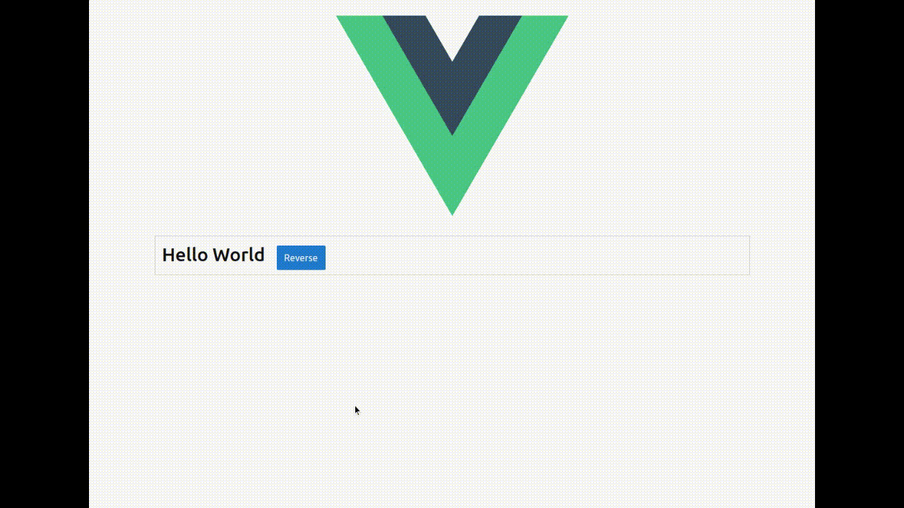

<p align="center">
<a href="https://vuejs.org" target="_blank" rel="noopener noreferrer">

</a>
</p>

# Vue Layout Designer
A Vue 2.x drag-and-drop grid layout designer, based on [Gridster.js](http://dsmorse.github.io/gridster.js)



---
| Vue | Build | Statements | Branches | Functions | Lines
| ------ | ------ | ------ | ------- | ------- | ------
|  |  |  |  |  | 
---

## Installation

~~~
npm i @thefoot/vue-layout-designer --save
~~~

## Usage

```javascript
import LayoutDesigner from '@thefoot/vue-layout-designer';

export default {
    ...
    components: { LayoutDesigner },
    ...
};
```

### Props
| Name | Attribute | Type     | Default | Description |
|------|-----------|----------|---------|-------------|
| name | name      | `String` | "World" |             |

### Methods
| Name | Description |
|------|-----------|
| reverse | Reverses the `name` prop for display |

### Events
| Name | Description |
|------|-----------|
|  | |

## Demo
[Component Demo](https://thefoot.github.io/vue-layout-designer/)

## Contributing
Contributions welcome, please read [CONTRIBUTING](docs/CONTRIBUTING.md) and [CODING-STANDARDS](docs/CODING-STANDARDS.md).

## Credits

### Author
- [@TheFoot](https://github.com/TheFoot)

### Contributors
- .

## Licence
[MIT](LICENCE.md)