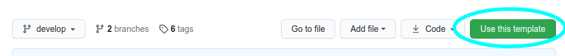

<p align="center">
<a href="https://vuejs.org" target="_blank" rel="noopener noreferrer">

</a>
</p>

# Vue Component Template
A template for creating a single Vue 2.x component for distribution via NPM, using Rollup/Babel.


---
| Vue | Build | Statements | Branches | Functions | Lines
| ------ | ------ | ------ | ------- | ------- | ------
|  |  |  |  |  | 
---

## Installation

This is a template repository. To create a new repository based on this one, click on the "USE THIS TEMPLATE" button:


 
Alternatively to work on this repository directly:
~~~
git clone git@github.com:TheFoot/vue-component-template.git
~~~

To install and use the NPM package within your project:

~~~
npm i @thefoot/vue-component-template --save
~~~

## Usage

```javascript
import HelloWorld from '@thefoot/vue-component-template';

export default {
    ...
    components: { HelloWorld },
    ...
};
```

### Props
| Name | Attribute | Type     | Default | Description |
|------|-----------|----------|---------|-------------|
| name | name      | `String` | "World" |             |

### Methods
| Name | Description |
|------|-----------|
| reverse | Reverses the `name` prop for display |

### Events
| Name | Description |
|------|-----------|
|  | |

## Demo
[Component Demo](https://thefoot.github.io/vue-component-template/)

## Contributing
Contributions welcome, please read [CONTRIBUTING](docs/CONTRIBUTING.md) and [CODING-STANDARDS](docs/CODING-STANDARDS.md).

## Credits

### Author
- [@TheFoot](https://github.com/TheFoot)

### Contributors
- .

## Licence
[MIT](LICENCE.md)