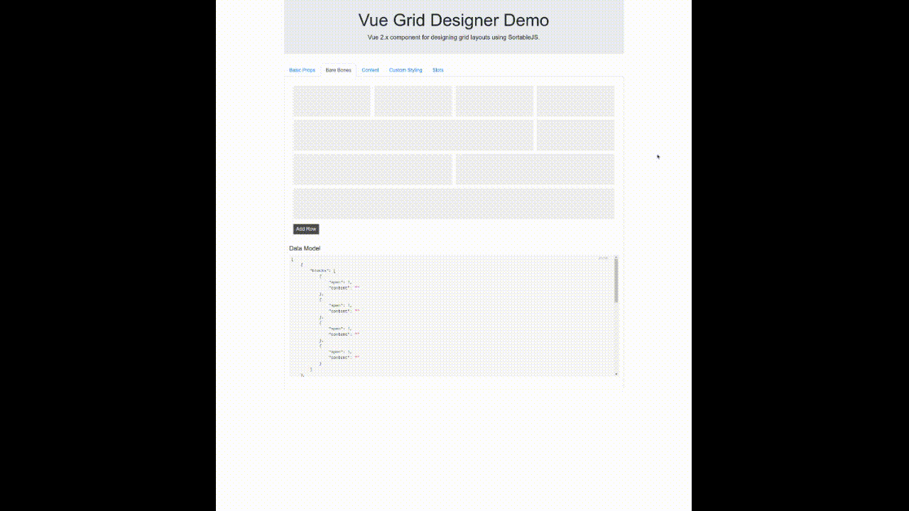

<p align="center">
<a href="https://vuejs.org" target="_blank" rel="noopener noreferrer">

</a>
</p>

# Vue Grid Designer
A Vue 2.x component for designing grid layouts using [Sortable.js](Vue 2.x component for designing grid layouts using SortableJS.)

---
| Vue | Build | Statements | Branches | Functions | Lines
| ------ | ------ | ------ | ------- | ------- | ------
|  |  |  |  |  | 
---

Design a responsive grid based on rows and blocks using HTML5 drag and drop. The JSON model can be used to generate an 
actual HTML grid using any CSS framework you choose or saved to a database for subsequent use. It can be decorated with 
any additional JSON properties to allow you to extend your grid in any way you need.



## Table of Contents
- [Dependencies](#dependencies)
- [Installation](#installation)
- [Usage](#usage)
  * [Grid Data Model](#grid-data-model)
    + [Internal model](#internal-model)
  * [Component Props](#component-props)
  * [Overidden Sortable JS Options](#overidden-sortable-js-options)
  * [Events](#events)
  * [Methods](#methods)
  * [CSS and Styles](#css-and-styles)
    + [CSS Classes Used](#css-classes-used)
    + [Specificity and Overriding Scoped Styles](#specificity-and-overriding-scoped-styles)
    + [Using :hover styles](#using--hover-styles)
- [Demo](#demo)
- [Contributing](#contributing)
- [Credits](#credits)
  * [Author](#author)
  * [Contributors](#contributors)
- [Licence](#licence)

## Dependencies
`vue-grid-designer` has no external dependency requirements. The following dependencies are included in the 
exported ESM package:
```json
{
    "@fortawesome/fontawesome-svg-core"  : "^1.2.30",
    "@fortawesome/free-solid-svg-icons"  : "^5.14.0",
    "@fortawesome/vue-fontawesome"       : "^2.0.0",
    "lodash-es"                          : "^4.17.15",
    "sortablejs"                         : "^1.10.2",
    "uuid"                               : "^8.3.0",
    "vue"                                : "^2.6.12"
}
```

## Installation

~~~
npm i @thefoot/vue-grid-designer --save
~~~

## Usage

Either register `vue-grid-designer` as a global component in your main Vue application file:
```javascript
import Vue             from 'vue';
import VueGridDesigner from '@thefoot/vue-grid-designer';
Vue.component('vue-grid-designer', VueGridDesigner);

new Vue (
    {
        render: h => h ( App )
    }
).$mount ( '#app' );
```

or use locally (recommended) in your Vue component:

```javascript
import VueGridDesigner from '@thefoot/vue-grid-designer';

export default {
    ...
    components: { VueGridDesigner }
    ...
};
```

Then simply add the component to your template and bind your grid model to it:

```vue
<template>
    <div>
        <vue-grid-designer v-model="grid"></vue-grid-designer>
    </div>
</template>

<script>
    import VueGridDesigner from '@thefoot/vue-grid-designer';
    export default { 
        components: { VueGridDesigner },
        data () {
            return {
                grid: []
            };
        }   
    };
</script>
```

You can even use it via a script tag:

```html
<script src="https://unpkg.com/vue"></script>
<script src="https://unpkg.com/vue-grid-designer"></script>
```

### Grid Data Model
The grid is a collection of `row` objects. `row.blocks` is a collection of `block` objects.

```javascript
[
    {
        blocks: [
            { 
                span: 1,
                content: '<p>Foo</p>'
            }
        ]
    }
]
```

It is structured this way to allow rows and blocks to be decorated with additional properties. Use-cases are most 
likely to need additional data.

#### Internal model
Internally - VDG adds an `_id` property to each row and block (v4 UUID). Custom events include the ID, whereas the bound model
only emits exactly what was passed in, including any custom properties. To retrieve the full internal model, including
custom properties, call the `getFullModel ()` component method.

### Component Props
| Name                        | Attr                            | Type    | Default | Description                                                                                                                                                                       |
|-----------------------------|---------------------------------|---------|---------|-----------------------------------------------------------------------------------------------------------------------------------------------------------------------------------|
| mode                        | mode                            | String  | `edit`  | Component mode - `edit` or `view`. View mode hides row and block controls, and displays any content passed in via `block.content`.                                                |
| blocksPerRow                | blocks-per-row                  | Number  | `4`     | Logical blocks per row. Each block can consume more than one logical block via `span` - like a table. But, like a responsive grid, you can exceed this number if you wish.        |
| maxRows                     | max-rows                        | Number  | `0`     | Maximum number of rows. `0` to disable. If you pass in a grid that exceeds this number, it will still display all rows, however if you remove the rows, you cannot add them back. |
| rowClass                    | row-class                       | String  |         | Pass in an additional CSS class for the grid row.                                                                                                                                 |
| blockClass                  | block-class                     | String  |         | Pass in an additional CSS class for the grid block.                                                                                                                               |
| minBlockHeight              | min-block-height                | Number  | `100`   | Minimum block height in pixels.                                                                                                                                                   |
| blockMargin                 | block-margin                    | Number  | `6`     | Block margin in pixels.                                                                                                                                                           |
| enableMoveBlocksBetweenRows | enable-more-blocks-between-rows | Boolean | `true`  | Allow blocks to be moved between different rows. Setting to `false` restricts blocks to their own row.                                                                            |
| sortableOptions             | sortable-options                | Object  | `{}`    | Native options passed directly through to the SortableJS constructor. Some options are overridden (see table below).                                                              |

### Overidden Sortable JS Options
| Prop                | Attr                  | SortableJS Option | Type     | Default              | Description                                                                |
|---------------------|-----------------------|-------------------|----------|----------------------|----------------------------------------------------------------------------|
| sortableGhostClass  | sortable-ghost-class  | ghostClass        | String   | `vgd__block--ghost`  | CSS class applied to the ghost element.                                    |
| sortableChosenClass | sortable-chosen-class | chosenClass       | String   | `vgd__block--chosen` | CSS class applied to the chosen element.                                   |
| sortableDragClass   | sortable-drag-class   | dragClass         | String   | `vgd__block--drag`   | CSS class applied to the dragged element.                                  |
| sortableAnimation   | sortable-animation    | animation         | Number   | `50`                 | Animation speed in `ms`. `0` to disable animations.                        |
| <not exposed>       | -                     | disabled          | Boolean  | -                    | Based on the `mode` prop. In view mode, the DnD functionality is disabled. |
| <not exposed>       | -                     | group             | String   | `vgd`                | Based on the `enableMoveBlocksBetweenRows` prop.                           |
| <not exposed>       | -                     | filter            | String   | `.no-drag`           | Used to disable grid elements from being dragged (toolbars).               |
| <not exposed>       | -                     | preventOnFilter   | Boolean  | `true`               | Related to `filter`.                                                       |
| <exposed as event>  | -                     | onUpdate          | Function | -                    | Used internally. See events table below.                                   |
| <exposed as event>  | -                     | onRemove          | Function | -                    | Used internally. See events table below.                                   |
| <exposed as event>  | -                     | onAdd             | Function | -                    | Used internally. See events table below.                                   |
| <exposed as event>  | -                     | onStart           | Function | -                    | Used internally. See events table below.                                   |
| <exposed as event>  | -                     | onEnd             | Function | -                    | Used internally. See events table below.                                   |

### Events
All events have a `vgd` property added to the original event (either SortableJS event or native event - whichever 
is relevant), and contain `row` and `block` properties. 

| Name         | Description                                                                                                                                                                                                                | Example                                                   |
|--------------|----------------------------------------------------------------------------------------------------------------------------------------------------------------------------------------------------------------------------|-----------------------------------------------------------|
| ready        | Fired when the grid is initialised and ready for use. No event data is emitted.                                                                                                                                            |                                                           |
| update       | Fired after a block has been moved, or expanded / collapsed (no native event available). Only fired when a block is moved within a row. When block is moved between rows, `remove-block` and `add-block` events are fired. | `vue-grid-designer @update="updateHandler" />`            |
| remove-block | Fired after a block has been removed.                                                                                                                                                                                      | `vue-grid-designer @remove-block="removeBlockHandler" />` |
| remove-row   | Fired after a row has been removed.                                                                                                                                                                                        | `vue-grid-designer @remove-row="rowRemoveHandler" />`     |
| add-block    | Fired after a new block has been added.                                                                                                                                                                                    | `vue-grid-designer @add-block="addBlockHandler" />`       |
| add-row      | Fired after a new row has been added.                                                                                                                                                                                      | `vue-grid-designer @add-row="addRowHandler" />`           |
| drag-start   | Fired when a drag action has started.                                                                                                                                                                                      | `vue-grid-designer @drag-start="dragStartHandler" />`     |
| drag-stop    | Fired when a drag action has ended.                                                                                                                                                                                        | `vue-grid-designer @drag-stop="dragStopHandler" />`       |
| block-changed| Fired when a block has been expanded or collapsed.                                                                                                                                                                         | `vue-grid-designer @block-changed="blockChangedHandler" />`       |
| input        | Fired by Vue implicitly for `v-model` support.                                                                                                                                                                             | -                                                         |

### Methods
Methods that receive an `event` parameter fire a custom event.

| Name              | Params                           | Description                                                                               |
|-------------------|----------------------------------|-------------------------------------------------------------------------------------------|
| getFullModel      | `()`                             | Return the full internal model including custom properties.|
| addBlock          | `( event, row, span = 1 )`       | Append a new block to a row.                                                              |
| deleteRow         | `( event, row )`                 | Delete a row from the grid.                                                               |
| deleteBlock       | `( event, row, block )`          | Delete a block from a row.                                                                |
| expandBlock       | `( event, row, block, num = 1 )` | Decrease the `span` for a given block.                                                    |
| collapseBlock     | `( event, row, block, num = 1 )` | Increase the `span` for a given block.                                                    |
| getEventData      | `( event, sourceRow = 'from' )`  | Return a `vgd` info object for a given event. `sourceRow` can be `from` or `to`.          |
| getBlockStyles    | `( row, block )`                 | Return a style object for a given block. Can be used with `:style="getBlockStyles(...)"`. |
| getAnimationStyle | `()`                             | Return the animation style object. Can be used with `:style="getAnimationStyle()"`.       |
| initGrid          | `()`                             | Initialise the grid. Called from `mounted()`.                                             |
| initSortableRow   | `( row )`                        | Initialise the SortableJS plugin for a given row.                                         |
| fireChanged       | `()`                             | Trigger the `input` event. Used for `v-model` support.                                    |

### CSS and Styles
This component uses [BEM](http://getbem.com/introduction/) methodology and naming convention.

#### CSS Classes Used
| CSS Class                     | Element                                         | Description                            |
|-------------------------------|-------------------------------------------------|----------------------------------------|
| `vgd__row`                    | Row                                             |                                        |
| `vgd__block`                  | Block                                           |                                        |
| `vgd__block__toolbar`         | Block toolbar                                   |                                        |
| `vgd__block__toolbar__button` | Block toolbar icon button                       |                                        |
| `vgd__block__content`         | Block content                                   |                                        |
| `vgd__row__toolbar`           | Row toolbar                                     |                                        |
| `vgd__row__toolbar__button`   | Row toolbar icon button                         |                                        |
| `vgd__footer__button`         | Add row button                                  |                                        |
| `vgd__block--ghost`           | Block variant for the sortable ghost element.   |                                        |
| `vgd__block--chosen`          | Block variant for the sortable chosen element.  |                                        |
| `vgd__block--drag`            | Block variant for the sortable dragged element. |                                        |
| `use-hover`                   | Row                                             | See note below on using :hover styles. |

#### Specificity and Overriding Scoped Styles
For scoped styles, Vue uses a data attribute based on the component ID to isolate styles to the component. In order to 
override these styles you should prefix all style overrides using your main app or component selector. E.g.:

```scss
#demo {
    .vgd__row { ... }
}
```
For additional examples, please look at the [Demo](https://thefoot.github.io/vue-grid-designer/) source code.

#### Using :hover styles
There is a [known issue](https://github.com/SortableJS/Sortable/issues/232) with `:hover` state in DnD elements 
in Chrome. The workaround is to scope any `:hover` styles. This scope is provided via the `.use-hover` class. E.g.:
```scss
.use-hover {
    .vgd__row:hover { ... }
}
``` 


## Demo
[Component Demo](https://thefoot.github.io/vue-grid-designer/)

## Contributing
Contributions welcome, please read [CONTRIBUTING](docs/CONTRIBUTING.md) and [CODING-STANDARDS](docs/CODING-STANDARDS.md).

## Credits

### Author
- [@TheFoot](https://github.com/TheFoot)

### Contributors
- .

## Licence
[MIT](LICENCE.md)